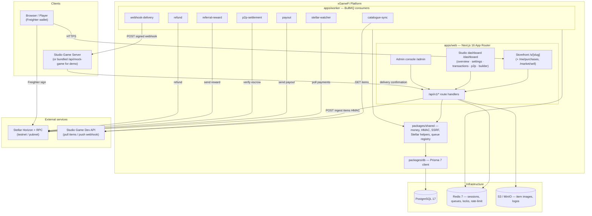
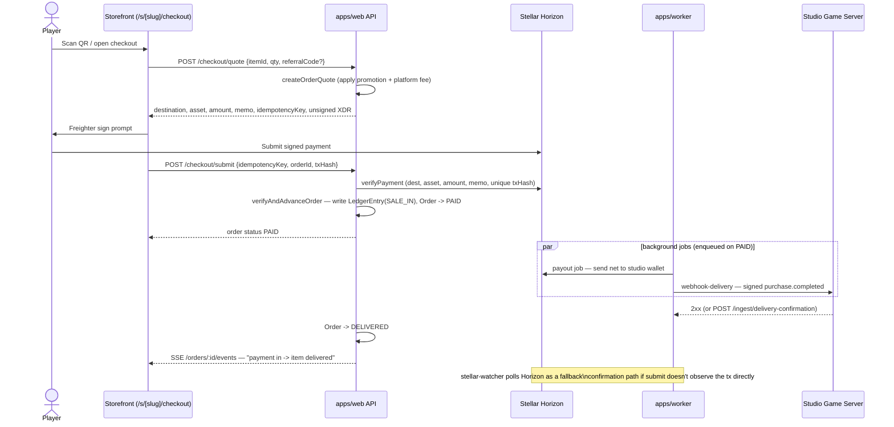
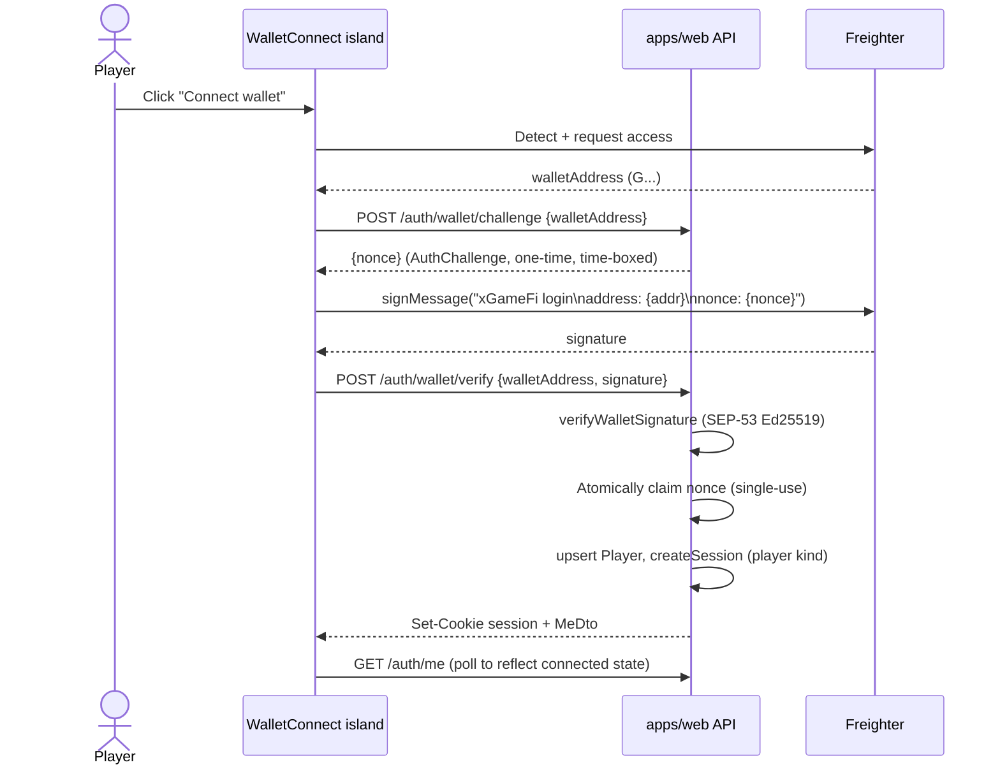
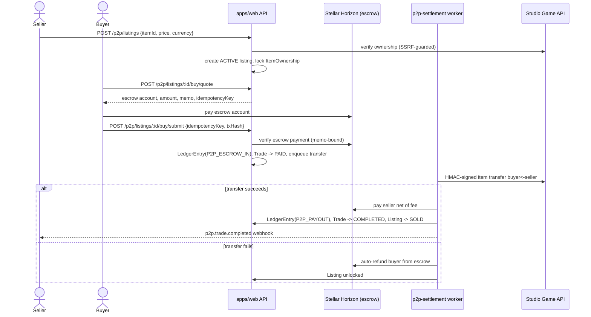
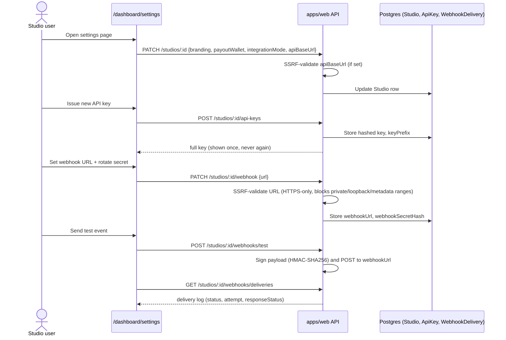

# xGameFi

> Commerce infrastructure for game studios — connect an item API, get a branded Stellar-powered storefront, get paid instantly.

xGameFi turns any game studio's existing item/inventory system into a fully hosted commerce platform: connect an item API (pull or push), get a branded, self-service storefront live in hours, and let players buy, resell, and gift in-game items using any Stellar wallet. It solves the "every studio reinvents payments" problem — instead of each indie team building its own payment rail, fraud/idempotency handling, escrow logic, and delivery pipeline from scratch, xGameFi provides all of it as shared infrastructure: on-chain-verified checkout, instant studio payouts, a peer-to-peer marketplace with escrow settlement, referrals, promotions, and a full studio dashboard for self-service onboarding (branding, API keys, webhooks, payout wallet) — end to end, from `POST /studios` to a delivered item, with no code the studio has to write beyond exposing its item API. The hero flow the whole system is built to prove: **player scans a QR code → pays with Freighter → item lands in their inventory within seconds, live on a transaction feed.**

Every payment, payout, escrow, and referral reward in xGameFi is a real, verified Stellar transaction — the platform is a **transaction-volume driver for the Stellar network**, not a wrapper around a centralized ledger. Each in-game purchase is an on-chain payment (native XLM or an issued asset) that Horizon confirms before an order advances; each studio payout, P2P escrow release, and referral reward is a distinct signed Stellar operation. For studios, this means near-instant settlement and materially lower take-rates than traditional card processors or platform storefronts (which often hold funds for weeks and take 30%). For Stellar, this means a repeatable, non-speculative, retail-volume use case — microtransaction-scale in-game commerce — running on Horizon/RPC infrastructure at production traffic patterns, expanding Stellar's footprint in gaming beyond wallets and DEX trading into everyday consumer payments. The [growth & ecosystem-integration report](#growth--stellar-ecosystem-impact) below outlines how deeper integration with Stellar-native primitives (SEP-24/anchors for fiat on/off-ramp, Soroban smart contracts for trustless escrow, path payments/DEX for any-asset checkout) could compound that impact.

## Status / License

| | |
| --- | --- |
| **Version** | `0.0.0` (all workspace packages are `private: true`, unversioned — pre-release/internal) [inferred] |
| **Stage** | **SPEC.md v1 feature-complete.** All Sprint 0–7 phases plus the post-Sprint-7 MVP gap-fill (studio dashboard overview/settings/transactions/P2P management, player purchase history, P2P sell page — [#129–#134](https://github.com/webnxt-2030/xgamefi/issues?q=is%3Aissue+129..134)) are merged to `develop`. **0 open issues.** A `staging` branch exists alongside `main`/`develop`, tracking Railway deploy prep. |
| **CI** | Passing on `develop` — lint, typecheck, `vitest` suite, Prisma drift check, `pnpm audit`, and the headline Playwright demo e2e are all green on the latest run ([`.github/workflows/ci.yml`](./.github/workflows/ci.yml)). |
| **License** | No `LICENSE` file found in the repository — license is unspecified [inferred]. See [License](#license). |

## Problem

Per [`SPEC.md`](./SPEC.md) §1: *"Every indie studio that wants to sell in-game items has to build its own payment rail, shop UI, and delivery pipeline."* That means each studio independently re-solves payment processing, storefront UI, fraud/idempotency handling, and item-delivery reliability before it can sell a single skin — a high fixed cost for teams whose core competency is making games, not commerce infrastructure.

## Vision / Purpose

xGameFi aims to be *"the missing layer"* (SPEC.md §1): a studio connects its game's item API and gets a professional Stellar-powered storefront in minutes, with players paying via any Stellar wallet and studios settling instantly after a platform fee. The project is explicitly built around a single, concrete proof point — the **anchor partner Gridlock Games** and a live demo moment (SPEC.md §1): an audience member scans a QR code, pays 1 USDT for a "Sword Skin" with Freighter, and within seconds the payment confirms on-chain, a signed webhook fires to Gridlock's server, the skin lands in the player's inventory, and a live transaction feed shows "payment in → item delivered." That demo is codified as a CI-gate: `e2e/demo.spec.ts` runs on every push (`.github/workflows/ci.yml`), and is now fully self-contained — a bundled mock game server (`/api/mock-game/items`, `/api/mock-game/webhook`) plays the role of Gridlock's backend so the entire demo runs without any external partner infrastructure.

## Target Users

- **Game studios (indie/small teams)** — want to monetize in-game items without building payment/delivery infrastructure themselves, and self-serve their own branding, API keys, webhook, and payout wallet from `/dashboard/settings`.
- **Players holding a Stellar wallet (Freighter)** — want to buy, trade, and resell in-game items with instant, low-fee settlement, a purchase history, and no new account/password.
- **Platform operators/admins** — need to onboard studios, set platform fees, and monitor a global ledger across all tenants (`/admin` console).
- **Game dev/backend teams** — integrate their item system once (pull or push API) and receive delivery webhooks instead of building a storefront.

## Features

Grouped by the actual routes and API handlers under `apps/web/app`:

**Storefront & catalogue**
- Branded per-studio storefront (`/s/[slug]`) with item grid, filters, search, and featured items.
- Item detail pages/modals (`/s/[slug]/item/[itemId]`).
- Catalogue sync from a studio's game API — **pull** (`POST /studios/:id/items/sync`, `catalogue-sync` BullMQ job) or **push** (`POST /api/v1/ingest/items`, HMAC-authenticated).
- Per-item studio overrides: price, currency, stock, sale window, featured (`PATCH /studios/:id/items/:itemId`).
- Wallet-gated player purchase history (`/s/[slug]/me/purchases`, `GET /api/v1/shops/:slug/orders/me`).

**Shop Builder**
- Three-panel drag-and-drop builder (`/dashboard/builder`) — item library, layout canvas (grid/list), item/pricing config, and a live preview that reuses the exact storefront renderer (`StorefrontGrid`).
- Draft/publish workflow (`PUT /studios/:id/shop/draft`, `POST /studios/:id/shop/publish`).

**Checkout / primary sale**
- Wallet-based player auth via Freighter (nonce challenge + SEP-53 Ed25519 signature verify) — no password.
- QR-code checkout deep links for scan-to-pay.
- Server-verified Stellar payments: `POST /checkout/quote` builds the payment XDR and price breakdown (promotions + platform fee); `POST /checkout/submit` verifies on-chain (destination, asset, amount, memo) before advancing the order — idempotent via `Idempotency-Key` header.
- Real-time order status via Server-Sent Events (`GET /orders/:id/events`), backed by Redis pub/sub.
- Background `stellar-watcher` job polls Horizon as a fallback confirmation path.
- Automatic studio payout (`payout` job) and signed `purchase.completed` webhook delivery with retry/backoff and DLQ (`webhook-delivery` job).
- Auto-refund on delivery failure/webhook exhaustion (`refund` job).

**P2P marketplace**
- List an owned item — either from a listing detail flow or the dedicated **sell page** (`/s/[slug]/market/sell`, `GET /api/v1/shops/:slug/me/items` to discover sellable inventory, `POST /p2p/listings` to publish) — ownership verified against the studio's game API before locking.
- Browse/buy listings (`/s/[slug]/market`, `GET /p2p/listings/query`, `/p2p/listings/:id`), escrow-based quote/submit (`POST /p2p/trades/quote`, `/submit`).
- Settlement state machine (`p2p-settlement` worker): escrow verify → item transfer via the game API → seller payout net of fee → ledger entries → `p2p.trade.completed` webhook; auto-refund buyer on transfer failure.

**Growth: referrals & promotions**
- Referral codes, invite binding, and automatic idempotent referrer rewards on a referred player's first qualifying purchase (`referral-reward` job).
- Promotions: `PERCENT`, `FIXED`, `BUNDLE`, `FIRST_PURCHASE`, applied server-side at quote time, respecting `startsAt`/`endsAt`/`usageLimit`.

**Studio dashboard (self-service)**
- **Overview** (`/dashboard`) — GMV, order count, fees collected, webhook delivery health, and recent orders for the logged-in studio (`computeStudioMetrics`).
- **Settings** (`/dashboard/settings`) — display name/branding, payout wallet, integration mode, `apiBaseUrl`, API key issue (shown once)/revoke, webhook URL/secret rotation + signed test event, and a delivery log with manual retry. This is the page that makes studio onboarding actually self-service.
- **Transactions** (`/dashboard/transactions`) — paginated, status-filterable list of the studio's orders with Horizon explorer links (`GET /studios/:id/orders`).
- **P2P management** (`/dashboard/p2p`) — read-only operational view of the studio's P2P listings and trades (`GET /studios/:id/p2p`).

**Admin console**
- Platform GMV/fees/active studios/recent orders (`/admin`), studio approval/suspension and fee configuration (`/admin/studios`), user management (`/admin/users`), global ledger (`/admin/transactions`), and platform settings, all RBAC-gated (`requireRole("ADMIN")`).

**Security & platform hardening**
- Tenant isolation (every studio-scoped query filtered by `studioId`).
- SSRF guard (`@xgamefi/shared/ssrf`) on every studio-supplied URL (`apiBaseUrl`, `webhookUrl`) — HTTPS-only, blocks private/loopback/metadata ranges.
- Constant-time HMAC verification with replay-window protection for webhooks/API-key auth.
- Rate limiting on auth, checkout, and listing routes; CSRF (same-origin + double-submit token) on session-mutating routes; audit logging on sensitive admin/studio actions (enforced by `auditCoverage.test.ts`).
- Security headers (CSP, HSTS, nosniff, referrer-policy, frame-ancestors) applied in `apps/web/proxy.ts`.

**Demo tooling**
- A bundled mock game server (`apps/web/app/api/mock-game/{items,webhook}`) simulates a studio's item API (GET/POST) and delivery-webhook receiver, so the seed data, local dev, and the CI e2e demo all run without any real external studio backend.

## Architecture



## Sequence diagrams

### 1. Primary sale — the hero flow (checkout)

Derived from `apps/web/app/api/v1/checkout/quote/route.ts`, `checkout/submit/route.ts`, `@xgamefi/shared/settlement`, and `apps/worker/src/jobs/{stellar-watcher,payout,webhook-delivery}.ts`.



### 2. Wallet auth (Freighter challenge/sign)

Derived from `apps/web/app/api/v1/auth/wallet/{challenge,verify}/route.ts` and the `WalletConnect` island (`docs/features.md` #126).



### 3. P2P trade escrow settlement (async)

Derived from `apps/web/app/api/v1/p2p/*`, `@xgamefi/shared/p2p/settlement`, and `apps/worker/src/jobs/p2p-settlement.ts`.



### 4. Studio self-service onboarding (settings)

Derived from `apps/web/app/(studio)/dashboard/settings/{page.tsx,studio-settings-client.tsx}` and `apps/web/app/api/v1/studios/[id]/{route.ts,api-keys,webhook,webhooks}`.



## Smart Contracts

No Soroban contract crates currently exist in this repository (no `Cargo.toml` / `contracts/` directory found). The system today settles payments as native Stellar Horizon payment operations (`@stellar/stellar-sdk`), not custom Soroban contracts. `SPEC.md` and `.env.example` reference a Soroban RPC endpoint (`STELLAR_RPC_URL`) but no contract has been added yet [inferred: reserved for future use]. See [Growth & Stellar ecosystem impact](#growth--stellar-ecosystem-impact) below for where Soroban-based escrow/settlement could plug in.

<!-- PLACEHOLDER: Soroban smart contracts — document each contract's purpose, public functions, parameters, and deployment/upload process here. -->

## Growth & Stellar ecosystem impact

A comprehensive report on business-viability features and Stellar-ecosystem integrations (SEPs, anchors, DEX/path payments, Soroban) worth adding next is tracked as GitHub issue **[#137](https://github.com/webnxt-2030/xgamefi/issues/137)**.

## Tech Stack

**Frontend** (`apps/web`)
- Next.js `^16.2.5` (App Router, Node runtime), React `19.2.0` / React DOM `19.2.0`
- Tailwind CSS `^4.3.0` + `@tailwindcss/postcss` (CSS-first `@theme`, per `BRAND.md`)
- `@dnd-kit/core ^6.3.1` (Shop Builder drag-and-drop)
- `qrcode ^1.5.4` (checkout QR codes)
- `@stellar/freighter-api ^5.0.0` (client-only wallet connect/signing)

**Backend / API**
- Next.js API route handlers (`apps/web/app/api/v1/*`)
- `apps/worker` — Node + `tsx`, BullMQ `^5.34.0` on `ioredis ^5.4.0`
- `argon2 ^0.41.0` (argon2id password hashing), `jose ^5.9.0` (CSRF double-submit tokens)
- `zod ^3.24.0` (input validation, `packages/shared/zod/*`)
- `bignumber.js ^9.1.2` (Decimal money math)

**Blockchain**
- `@stellar/stellar-sdk ^15.1.0` — Horizon payment verification, XDR building, payouts
- Networks: Stellar testnet (`STELLAR_NETWORK=testnet`) and pubnet (production), Horizon + RPC endpoints configured via env

**Smart Contracts**
- None present — see [Smart Contracts](#smart-contracts).

**Database / Storage**
- PostgreSQL 17, Prisma `^7.8.0` + `@prisma/adapter-pg` (`pg ^8.13.0`) — single client in `packages/db`
- Redis 7 — sessions, BullMQ queues, distributed locks, idempotency, rate-limiting
- S3-compatible object storage (MinIO locally) for item images/studio logos

**Infra / CI**
- pnpm `10.12.1` workspaces (`pnpm-workspace.yaml`), Node.js `>=22`
- Docker + `docker-compose.yml` (Postgres, Redis, MinIO, migrate/seed/web/worker services), multi-stage `Dockerfile`
- Railway deploy configs: `railway.web.json`, `railway.worker.json` (Nixpacks builder); a `staging` branch tracks deploy prep alongside `main`/`develop`
- GitHub Actions CI (`.github/workflows/ci.yml`): lint, typecheck, `vitest` unit/integration tests, Prisma migration-drift check, `pnpm audit --audit-level high`, and a headline Playwright e2e gate (`e2e/demo.spec.ts`)
- Playwright `^1.49.0` for e2e tests (`apps/web/e2e`)
- ESLint `^9.15.0`, Prettier `^3.4.0`, TypeScript `^5.6.0` (strict)

## How to Run Locally

**Prerequisites** (from `README.md`/`package.json`/`.nvmrc`):
- Node.js 22 LTS
- pnpm 10.x (`corepack enable && corepack prepare pnpm@10.12.1 --activate`)
- Docker (for local Postgres 17 / Redis 7 / MinIO)

### Option A — Full stack in Docker

```bash
pnpm install
cp .env.example .env          # then fill in values (see table below)
docker compose up -d --build  # Postgres 17, Redis 7, MinIO + web (:3000) + worker + migrate/seed
```
The `web` container runs Next.js in dev mode; migrations and seed run automatically before the app starts.

### Option B — Local pnpm workflow

```bash
pnpm install
cp .env.example .env          # then fill in values
docker compose up -d          # Postgres 17, Redis 7, MinIO only
pnpm db:generate
pnpm --filter @xgamefi/db exec prisma migrate deploy
pnpm db:seed                  # admin + Gridlock studio + published shop + Sword Skin @ 1 USDT

pnpm --filter @xgamefi/web dev      # web on :3000
pnpm --filter @xgamefi/worker dev   # queue workers
```

Health checks: `GET /api/health` (liveness), `GET /api/ready` (DB + Redis).

### Environment variables (`.env.example`)

All variables below are validated fail-fast by the Zod schema in `packages/config/src/env.ts` — the app will not boot if a **required** var is missing or malformed. There are no vars that are truly optional at runtime; a few have schema defaults.

| Variable | Required? | Notes |
| --- | --- | --- |
| `NODE_ENV` | Has default (`development`) | |
| `APP_BASE_URL` | Required | Must be a valid URL |
| `SESSION_SECRET` | Required | ≥32 characters |
| `DATABASE_URL`, `SHADOW_DATABASE_URL` | Required | Postgres connection + Prisma shadow DB (migration diff) |
| `REDIS_URL` | Required | |
| `S3_ENDPOINT`, `S3_REGION`, `S3_BUCKET`, `S3_ACCESS_KEY_ID`, `S3_SECRET_ACCESS_KEY` | Required | `S3_FORCE_PATH_STYLE` defaults to `true` |
| `ADMIN_USERNAME`, `ADMIN_PASSWORD` | Required | Used only by the seed script to bootstrap the platform admin |
| `STELLAR_NETWORK` | Required | `testnet` or `pubnet` |
| `STELLAR_HORIZON_URL`, `STELLAR_RPC_URL` | Required | |
| `STELLAR_RECEIVING_ACCOUNT` | Required | Platform receiving/escrow public key (`G...`) |
| `STELLAR_PAYOUT_SIGNER_SECRET` | Required | **Never commit a real secret** |
| `STELLAR_USD_ASSET_CODE`, `STELLAR_USD_ASSET_ISSUER` | Required | Demo "USDT" stablecoin asset |
| `PLATFORM_FEE_BPS` | Required | Basis points, 0–10000 |
| `REFERRAL_REWARD_AMOUNT` | Has default (`0.1`) | |
| `REFERRAL_REWARD_CURRENCY` | Optional | `XLM` or `USDT` |
| `WEBHOOK_MAX_ATTEMPTS` | Has default (`5`) | |
| `WEBHOOK_TIMESTAMP_TOLERANCE_SEC` | Has default (`300`) | Replay-window tolerance for inbound/outbound HMAC signatures |

### Checks

```bash
pnpm lint        # eslint
pnpm typecheck   # tsc --noEmit across packages
pnpm test        # vitest
```

## Deployment

Per `railway.web.json` / `railway.worker.json` and CI, the project targets **Railway** with a Nixpacks builder:

- **web** service — build: `pnpm install --frozen-lockfile && pnpm --filter @xgamefi/db prisma generate && pnpm --filter @xgamefi/web build`; pre-deploy runs `prisma migrate deploy` + `prisma generate`; start: `pnpm --filter @xgamefi/web start`; health check `/api/health`; `numReplicas: 1`, restarts `ON_FAILURE`.
- **worker** service — build: `pnpm install --frozen-lockfile && pnpm --filter @xgamefi/db prisma generate`; start: `pnpm --filter @xgamefi/worker start`; `numReplicas: 1`, restarts `ON_FAILURE`.
- Managed Postgres and Redis, plus a MinIO service or volume for object storage [inferred from `SPEC.md` §11].
- A `staging` branch now exists in the repository alongside `main`/`develop`, consistent with active Railway deploy preparation; CI (`.github/workflows/ci.yml`) runs on push to `main`/`develop` and on pull requests but does not itself deploy — deployment is presumed to be Railway's own git-integration trigger [inferred, not confirmed in repo].

Live environment:
- **Production URL:** `[PLACEHOLDER: Live app URL]`
- **Staging/demo URL:** `[PLACEHOLDER: Live app URL]`

## Demo

- **Live app:** `[PLACEHOLDER: Live app URL]`
- **Demo video:** `[PLACEHOLDER: Demo video URL]`
- **Screenshot:** `[PLACEHOLDER: screenshot]`
- **Pitch deck:** [`docs/pitch-deck.md`](./docs/pitch-deck.md) (draft slide content; see also `docs/pitch-deck-draft-xGameFi.pptx`)

The canonical demo acceptance flow (`SPEC.md` §13, automated as `apps/web/e2e/demo.spec.ts` and gated in CI): open `/s/gridlock`, scan the Sword Skin QR, pay 1 USDT on testnet via Freighter — within seconds the order goes `PAID` then `DELIVERED`, payout is sent to the Gridlock wallet, a signed `purchase.completed` webhook is delivered, and the `/orders/:id/events` SSE feed shows "payment in → item delivered."

## Team

| Name | Role | Contact |
| --- | --- | --- |
| `[PLACEHOLDER: name]` | `[PLACEHOLDER: role]` | `[PLACEHOLDER: contact]` |
| `[PLACEHOLDER: name]` | `[PLACEHOLDER: role]` | `[PLACEHOLDER: contact]` |

## License

No `LICENSE` file is present in this repository at the time of writing, and `package.json` marks all workspace packages `"private": true`. Treat this project as **all rights reserved** until a license is explicitly added [inferred].

---

See [`SPEC.md`](./SPEC.md) for the full product spec, [`AGENT.md`](./AGENT.md) for engineering rules and the pinned dependency list, [`BRAND.md`](./BRAND.md) for design tokens, [`docs/features.md`](./docs/features.md) for the shipped-feature log, [`docs/migrations.md`](./docs/migrations.md) for DB conventions, and [`docs/superpowers/plans`](./docs/superpowers/plans) for phase-by-phase implementation plans.
